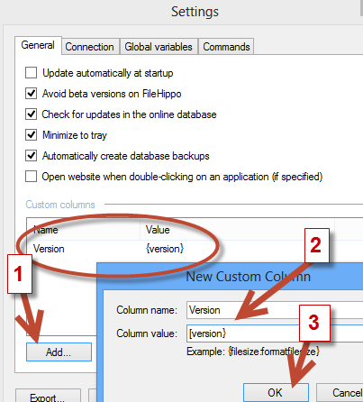
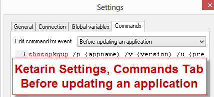
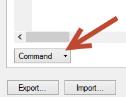
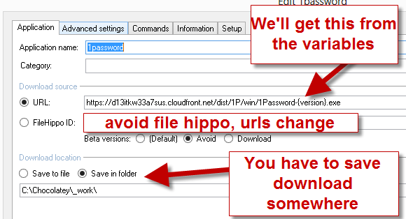
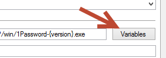
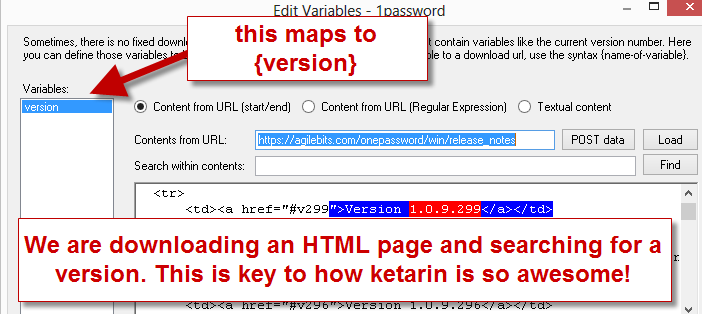
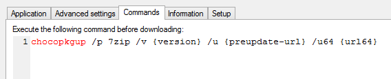

## Automatic Packages
Automatic packages are what set chocolatey apart from other package managers.
http://chocolatey.org/packages/ChocolateyPackageUpdater

## Chocolatey Package Updater aka chocopkgup
The tool that accomplishes this process is known as [chocopkgup](http://chocolatey.org/packages/ChocolateyPackageUpdater) (Chocolatey Package Updater). It is a free tool (unless you want to use it for uploads to somewhere other than chocolatey.org).

### Licensing
Check the license at http://realdimensions.net/licenses/chocolateypackageupdater/license.txt to be sure that it applies to you.

Basically it boils down to this: if you want to use chocopkgup privately, you will need to pay for it. As long as you are publishing to chocolatey.org, the tool is completely free! The license does expire every once in awhile, but if you are keeping up on your chocolatey updates locally, you won't even notice (`cup all`, remember?).

### Credits
This tool makes use of [Ketarin](http://chocolatey.org/packages/ketarin). Ketarin is an awesome tool that helps chocopkgup accomplish its tasks.

### Setup
More of this will become automated over time.

1. **Optional** (strongly recommended) - Ensure you are using a source control repository and file system for keeping packages. A good example is [chocolatey-coreteampackages](https://github.com/chocolatey/chocolatey-coreteampackages) repo.
1. **Optional** (strongly recommended) - Make sure you have installed the [chocolatey package templates](https://github.com/chocolatey/chocolateytemplates). If you’ve installed the chocolatey templates (ReadMe has instructions), then all you need to do is take a look at the [chocolateyauto](https://github.com/chocolatey/chocolateytemplates/tree/master/_templates/chocolateyauto) and [chocolateyauto3](https://github.com/chocolatey/chocolateytemplates/tree/master/_templates/chocolateyauto3). You will note this looks almost exactly like the regular chocolatey template, except this has some specially named token values.
```powershell
#Items that could be replaced based on what you call chocopkgup.exe with
#{{PackageName}} - Package Name (should be same as nuspec file and folder) |/p
#{{PackageVersion}} - The updated version | /v
#{{DownloadUrl}} - The url for the native file | /u
#{{PackageFilePath}} - Downloaded file if including it in package | /pp
#{{PackageGuid}} - This will be used later | /pg
#{{DownloadUrlx64}} - The 64bit url for the native file | /u64
## included with 0.6.4
#{{Checksum}} - The checksum for the file downloaded from DownloadUrl | /c
#{{Checksumx64}} - The checksum for the 64bit file downloaded from DownloadUrlx64  | /c64
```
1. These are the tokens that chocopkgup will replace when it generates an instance of a package.
1. Install chocopkgup (which will install ketarin and nuget.commandline). `cinst chocolateypackageupdater`.
1. Check the config in `C:\tools\ChocolateyPackageUpdater\chocopkgup.exe.config` (or `ChocolateyBinRoot/ChocolateyPackageUpdater`). The `PackagesFolder` key should point to where your repository is located.
1. Create a scheduled task (in Windows). This is the command (edit the path to `cmd.exe` accordingly): `C:\Windows\System32\cmd.exe /c c:\tools\chocolateypackageupdater\ketarinupdate.cmd` 
1. Alternatively to stop the command window from opening on Windows, you can create a VBS script as well and put the path to the `.vbs` file instead of `ketarinupdate.cmd` as the command to run. The file should have the following:
```
Set objShell = WScript.CreateObject("WScript.Shell")
objShell.Run("C:\tools\ChocolateyPackageUpdater\ketarinupdate.cmd"), 0, True
```
1. Choose a schedule for the task. I run mine once a day but you can set it to run more often. Choose a time when the computer is not that busy.
1. Save the following Ketarin template somewhere: https://raw.github.com/chocolatey/chocolateytemplates/master/_templates/KetarinChocolateyTemplate.xml
1. Open Ketarin. Choose `File` –> `Settings`.
1. On the **General Tab** we are going to add the Version Column for all jobs. Click `Add…`, then put `Version` in Column name and `{version}` in Column value.

1. Click **[OK]**. This should add it to the list of Custom Columns.
1. Click on the **Commands Tab** and set **Edit command for event** to “Before updating an application”.

1. Add the following text:
```cmd
chocopkgup /p {appname} /v {version} /u "{preupdate-url}" /u64 "{url64}" /pp "{file}"
REM /disablepush
```
1. Check the bottom of this section to be sure it set to **Command**.

1. Click Okay.
1. Note the commented out `/disablepush`. This is so you can create a few packages and test that everything is working well before actually pushing those packages up to chocolatey. You may want to add that switch to the main command above it. Add it as the first parameter after `chocopkgup` so that none of the other commands conflict.

This gets Ketarin all set up with a global command for all packages we create. If you want to use this outside of chocolatey, all you need to do is remove the global setting for Before updating an application and instead apply it to every job that pertains to chocolatey update.

### Create an Automatic Package
Preferably you are taking an existing package that you have tested and converting it to an automatic package.

1. Open Ketarin. Choose `File` –> `Import…`
1. Choose the template you just saved earlier (`KetarinChocolateyTemplate.xml`).
1. Answer the questions. This will create a new job for Ketarin to check.
1. One important thing to keep in mind is that **the name of the job needs to match the name of the package folder exactly.**
1. Right click on that new job and select `Edit`. Take a look at the following:

1. Set the URL appropriately. I would shy away from FileHippo for now, the URL has been known to change and if you upload that as the download url in a chocolatey packages, it won’t work very well.
1. Click on `Variables` on the right of URL

1. On the left side you should see a variable for **version** and one for **url64**. Click on **version**.
1. Choose the appropriate method for you. Here I’ve chosen **Content from URL (start/end)**.
1. Enter the URL for versioning information.

1. In the contents itself, highlight enough good information before a version to be able to select it uniquely during updates (but not so much it doesn’t work every time as the page changes). Click on **Use selection as start**.
1. Now observe that it didn’t jump back too far.
1. Do the same with the ending part, keeping in mind that this side doesn’t need to be too much because it is found AFTER the start. Once selected click on **Use selection as end**.
1. It should look somewhat similar to have is presented in the picture above.
1. If you have a 64bit url you want to get, do the same for the url64 variable.
1. When all of this is good, click **OK**.
1. Click **OK** again.


### Notes about tri-packages (meta/virtual aka *, *.install, and *.portable)

When you have the three packages, you should set up only two jobs, one for *.install and one for *.portable.

In whichever job the meta package points to, you should add a command to that like you did for the settings for all jobs in ketarin.

1. Click on the **Commands Tab** and set **Edit command for event** to “Before updating an application”.

1. Add the following text (replace `name` with the actual name of the meta package folder):
```cmd
chocopkgup /p name /v {version} /u "{preupdate-url}" /u64 "{url64}" /pp "{file}"
REM /disablepush
```
1. Check the bottom of this section to be sure it set to **Command**.


### Testing Ketarin/ChocoPkgUp:

1. We need to get a good idea of whether this will work or not.
1. Open a command line and type `ketarin`.
1. Once Ketarin opens, open [global options](#setup) (steps 10 and 11) and set `/disablepush` so that it only goes as far as creating packages.
 * **NOTE**: Do not append it the end, place it first, right after `chocopkgup` e.g. `chocopkgup /disablepush /p ...`. This is done to alleviate issues with messed up parameters coming back from other items.
1. Find your job, and right click -> Update.  If everything is set good, in moments you will have a Chocolatey package in the folder you set under `{PackagesFolder}\_output`, where `{PackagesFolder}` is the path you set in the course of the [*Setup*](#setup) section of this article.
1. Inspect the resulting Chocolatey package(s) for any issues.
1. You should also test the scheduled task works appropriately.

### Troubleshooting/Notes

* Ketarin comes with a logging facility so you can see what it is doing. It’s under View –> Show Log.
* In the top level folder for chocopkgup (in program data), we log what we receive from Ketarin as well and the process of putting together a package.
* The name of the application in ketarin matches exactly that of the folder that is in the automatic packages folder.
* Every once in awhile you want to look in Ketarin to see what jobs might be failing. Then figure out why.
* Every once in awhile you will want to inspect the chocopkgupfolder to see if there are any packages that did not make it up for some reason or another and then upload them.

### Important notes for files hosted on SourceForge
Try this first:
* In advanced settings, change the user agent to `chocolatey command line`. This will allow ketarin to behave similarly to how Chocolatey does.


If you want to make an automatic package that downloads files hosted on SourceForge, it gets a bit tricky. Ketarin does not directly support download links from SourceForge in the format `http://sourceforge.net/projects/…/download`, because these download links automatically redirect to a mirror (e.&nbsp;g. `http://heanet.dl.sourceforge.net/project/…`). Ketarin does not support these kind of automatic redirections, but Chocolatey does.

It isn’t uncommon that certain SorceForge mirrors go offline or are extremely slow because of overload. Thus it is not recommended to use direct mirror links (e.&nbsp;g. `http://heanet.dl.sourceforge.net/project/…`) in your `chocolateyInstall.ps1` file, because this will frequently break your package and makes it unreliable.
To avoid this, use the following convention for files hosted on SourceForge:
* Don’t use `{{DownloadUrl}}` and `{{DownloadUrlx64}}` in your `chocolateyInstall.ps1` file, but use this instead (example of the app nomacs):
`$url = 'http://sourceforge.net/projects/nomacs/files/nomacs-{{PackageVersion}}/nomacs-setup-{{PackageVersion}}-x86.exe/download'`
and
`$url64 = 'http://sourceforge.net/projects/nomacs/files/nomacs-{{PackageVersion}}/nomacs-setup-{{PackageVersion}}-x64.exe/download'`
For other applications obviously you have to use the actual application/file names. Important is that you use `{{PackageVersion}}` and don’t use any direct links which include SourceForge mirrors.
* In Ketarin there’s no other possibility than using the direct link to a file with an included mirror (e.&nbsp;g. `http://garr.dl.sourceforge.net/project/nomacs/nomacs-{version}/nomacs-setup-{version}-x86.exe`). Unfortunately then Ketarin will occasionally fail to download this file and you will have to manually replace the mirror with a working one to get your automatic package updated. Any clue to fix this issue will be appreciated.
