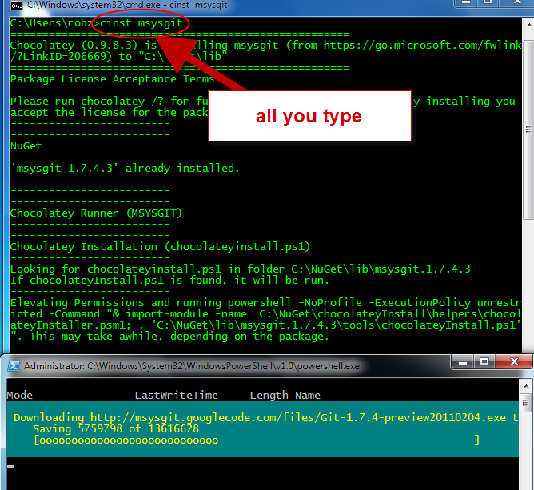
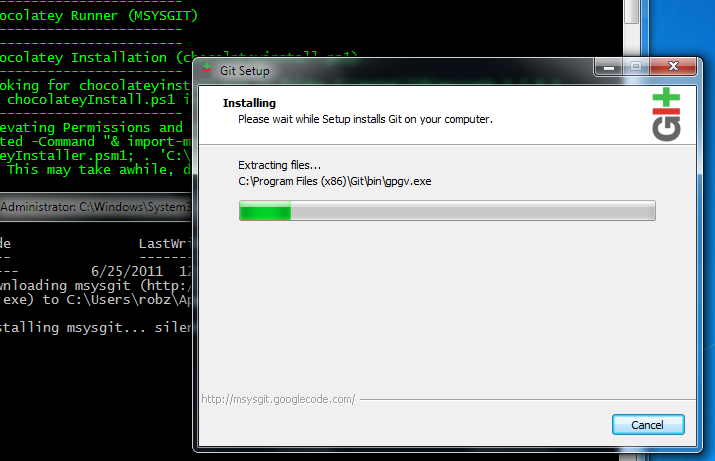
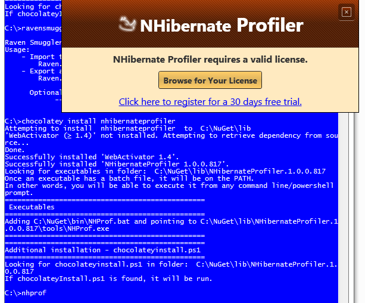
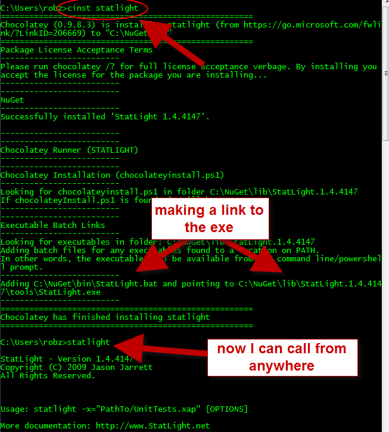
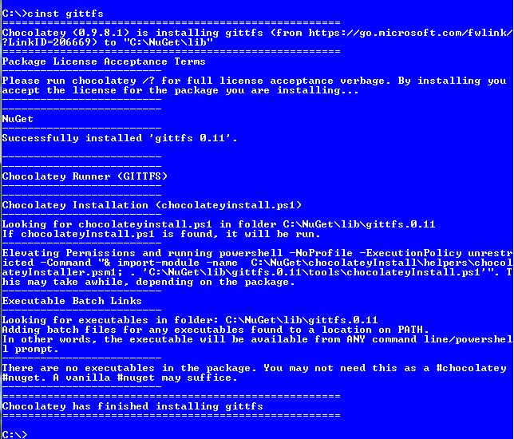
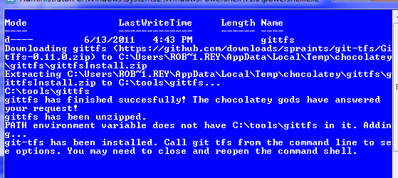

# Chocolatey Install (cinst)
Unconditionally installs a package or a list of packages in a packages.config, even if it already exists.  
`chocolatey install packageName` or shortcut with 
`cinst packageName` or `cinst packages.config`  
  
##Parameters
###PackageName
Name of package to install.  
  
###Packages.config - v0.9.8.13+
Alternative to PackageName. This is a list of packages in an xml manifest for chocolatey to install.  This is like the packages.config that NuGet uses except it also adds the source element.  
  
```xml
<?xml version="1.0" encoding="utf-8"?>
<packages>
  <package id="apackage" />
  <package id="anotherPackage" version="1.1" />
  <package id="chocolateytestpackage" version="0.1" source="somelocation" />
</packages>  
```  
  
###All - v0.9.8.15+
Alternative to PackageName. This allows you to keep your packages in a feed somewhere and maintain that feed over maintaining a file. 
When this is specified you must pass in a source that is not MS official or Chocolatey official as the hit would likely be way too big.  
  
###Prerelease (optional) - v0.9.8.15+
Whether to include prerelease packages in results.  
This is optional if you explicitly ask for a specific version that is a pre-release package.  
You can pass this as `-pre` or `-prerelease`.  
Defaults to false.  
  
###Version (optional)
The version of the package to install.  
Defaults to the latest version available.  
  
###Source (optional)
Source (directory, share or remote url feed) the package comes from. You can specify multiple sources by separating with a semi-colon and double quotes surrounding source.  
Example `-source ""http://chocolatey.org/api/v2/;http://someother/feed/""`  
Defaults to official chocolatey feed.  
  
#### -source ruby (v0.9.8.13+)  
This specifies the source is Ruby Gems and that we are installing a gem. If you do not have ruby installed prior to running this command, the command will install that first.  
  
#### -source webpi (v0.9.8.13+)
This specifies the source is Web PI and that we are installing a WebPI product, such as IISExpress. If you do not have the Web PI command line installed, it will install that first and then the product requested.  
  
#### -source cygwin (v0.9.8.17+)
This specifies the source is Cygwin and that we are installing a cygwin package, such as bash. If you do not have Cygwin installed, it will install that first and then the product requested.  
  
#### -source python (v0.9.8.17+)
This specifies the source is Python and that we are installing a python package, such as Sphinx. If you do not have easy_install and Python installed, it will install that first and then the product requested.  
  
###InstallArguments (optional) - v0.9.8.13+
Install arguments that you want to pass to the native installer (if you have some custom ones that you know). By default this appends to the items already passed, unless you also pass `-overrideArguments`.  
You can pass this as `-ia` `-installArgs` or `-installArguments`.  
Note: You may need to specify double quotes (`""some args""`) as powershell wants to strip off one set of quotes.  
Defaults to ''.  

###OverrideArguments (optional) - v0.9.8.13+
If you want to override the original install arguments (for the native installer) in the package and use your own. Use with InstallArguments.
You can pass this as `-o` `-override` `-overrideArgs` or `-overrideArguments`.  
Defaults to false.  

###NotSilent (optional) - v0.9.8.13+
If you want to use the native installer to step through the installer, use `-notSilent` to have chocolatey download the package and installer and bring it up for you.  
Defaults to false.  
  
##Examples
`chocolatey install nunit`  
  
`chocolatey install nunit -version 2.5.7.10213`  
  
`chocolatey install nunit -version 2.5.7.10213 -source http://somelocalfeed.com/nuget`  
  
`cinst nunit -version 2.5.7.10213 -source http://somelocalfeed.com/nuget`  
  
`cinst nunit -source \\someserver\someshare`  
  
`cinst nunit -source c:\somefolder`  
  
`cinst nunit -source ""http://chocolatey.org/api/v2/;c:\somefolder""`  
  
`cinst nodejs.install -installArgs "/qb"`  
  
`cinst nodejs.install -installArgs "/qb" -override`  
  
`cinst nodejs.install -notSilent`  
  
`cinst packages.config`  
  
##Screenshots
Installing mSysGit silently:  
  
  
  
NHProf:  
  
  
Statlight:  
  
  
Git-Tfs:  
  
  
  
[[Command Reference|CommandsReference]]