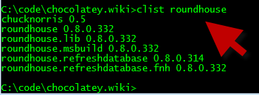

# Chocolatey List (clist)
Lists packages available from a remote source.  
`chocolatey list packageName` or shortcut with 
`clist packageName` 
  
###NOTE: Some chocolatey packages are tagged with chocolatey. To see what chocolatey packages are available, type `clist chocolatey`. This is not a comprenhensive listing, but it's enough to give you an idea.  
  
##Parameters
###Filter
A way to filter down results. Searches against name/description/tag.  
  
###AllVersions (optional) - v0.9.8.13+
Whether to display more than one version of given results or not. Specified by either `-allversions` or `-all`.  
Defaults to false. 
  
###Source (optional)
Source (directory, share or remote url feed) the package comes from.  
Defaults to official chocolatey feed.  
  
#### -source webpi (v0.9.8.13+)
This retrieves a lising from what's available and installed based on WebPI.  
  
##Examples
`chocolatey list nunit`  
  
`chocolatey list nunit -all`  
  
`chocolatey list nunit -source http://somelocalfeed.com/nuget`  
  
`chocolatey list nunit -source http://somelocalfeed.com/nuget -all`  
  
`clist nunit -source http://somelocalfeed.com/nuget`  
  
`clist -source webpi`  
  
  
  
[[Command Reference|CommandsReference]]