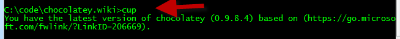

# Chocolatey Upgrade (cup)
Upgrades an existing package to the latest version, if there is a newer version available.
`choco upgrade packageName` or shortcut with `cup packageName`.
### Upgrade all packages to the latest version with `cup all`.

Upgrades a package or a list of packages.

Usage: `choco upgrade pkg [pkg2 pkgN] [options/switches]`

NOTE: `all` is a special package keyword that will allow you to upgrade
 all currently installed packages.

NOTE: If you do not have a package installed, upgrade will error.

Examples:

 `choco upgrade chocolatey`
 `choco upgrade notepadplusplus googlechrome atom 7zip`
 `choco upgrade notepadplusplus googlechrome atom 7zip -dvfy`
 `choco upgrade git --params="/GitAndUnixToolsOnPath /NoAutoCrlf" -y`
 `choco upgrade nodejs.install --version 0.10.35`

## Options and Switches

  -s, --source=VALUE         Source - The source to find the package(s) to
                               install. Special sources include: ruby, webpi,
                               cygwin, windowsfeatures, and python. Defaults to
                               default feeds.
      --version=VALUE        Version - A specific version to install.
                               Defaults to unspecified.
      --pre, --prerelease    Prerelease - Include Prereleases? Defaults to
                               false.
      --x86, --forcex86      ForceX86 - Force x86 (32bit) installation on 64
                               bit systems. Defaults to false.
      --ia, --installargs, --installarguments, --install-arguments=VALUE
                             InstallArguments - Install Arguments to pass to
                               the native installer in the package. Defaults to
                               unspecified.
  -o, --override, --overrideargs, --overridearguments, --override-arguments
                             OverrideArguments - Should install arguments be
                               used exclusively without appending to current
                               package passed arguments? Defaults to false.
      --notsilent, --not-silent
                             NotSilent - Do not install this silently.
                               Defaults to false.
      --params, --parameters, --pkgparameters, --packageparameters, --package-parameters=VALUE
                             PackageParameters - Parameters to pass to the
                               package. Defaults to unspecified.
  -m, --sxs, --sidebyside, --side-by-side, --allowmultiple, --allow-multiple, --allowmultipleversions, --allow-multiple-versions
                             AllowMultipleVersions - Should multiple versions
                               of a package be installed? Defaults to false.
  -i, --ignoredependencies, --ignore-dependencies
                             IgnoreDependencies - Ignore dependencies when
                               upgrading package(s). Defaults to false.
  -n, --skippowershell, --skip-powershell
                             Skip Powershell - Do not run chocolateyInstall.ps1. Defaults to false.

##Parameters
###PackageName
Name of package to update. If `all`, it compares against all installed packages.

###Source
Optional
Source (directory, share or remote url feed) the package comes from.
Defaults to official chocolatey feed.
You can pass this as `-source`

###Prerelease (optional) - v0.9.8.15+
Whether to include prerelease packages in results.
This is optional if you explicitly ask for a specific version that is a pre-release package.
You can pass this as `-pre` or `-prerelease`.
Defaults to false.

##Examples
`chocolatey update` — _Updates chocolatey to the latest version._

`chocolatey update all` — _Updates all installed packages to their latest versions._

`chocolatey update nunit` — _Updates the `nunit` package to its latest version._

`chocolatey update nunit -source http://somelocalfeed.com/nuget` — _Updates the `nunit` package to its latest version from the specified nuget feed, rather than from Chocolatey.org._

`cup nunit -source http://somelocalfeed.com/nuget` — _Shorthand version of the above command._

[[Command Reference|CommandsReference]]
