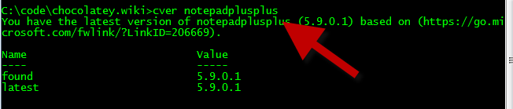

# Chocolatey Version (cver)
Compares an installed package to the version available from a remote feed.  
`chocolatey version packageName` or shortcut with 
`cver packageName`  
  
##Parameters
###PackageName
Name of package to check. If left empty, assumes you meant check chocolatey.  
  
###Source (optional)
Source (directory, share or remote url feed) the package comes from.  
Defaults to official chocolatey feed.  
  
##Examples
`chocolatey version` - looks to see if there is an update available for chocolatey  
  
`chocolatey version nunit`  
  
`chocolatey version nunit -source http://somelocalfeed.com/nuget`  
  
`cver nunit -source http://somelocalfeed.com/nuget`  
  
  
  
[[Command Reference|CommandsReference]]