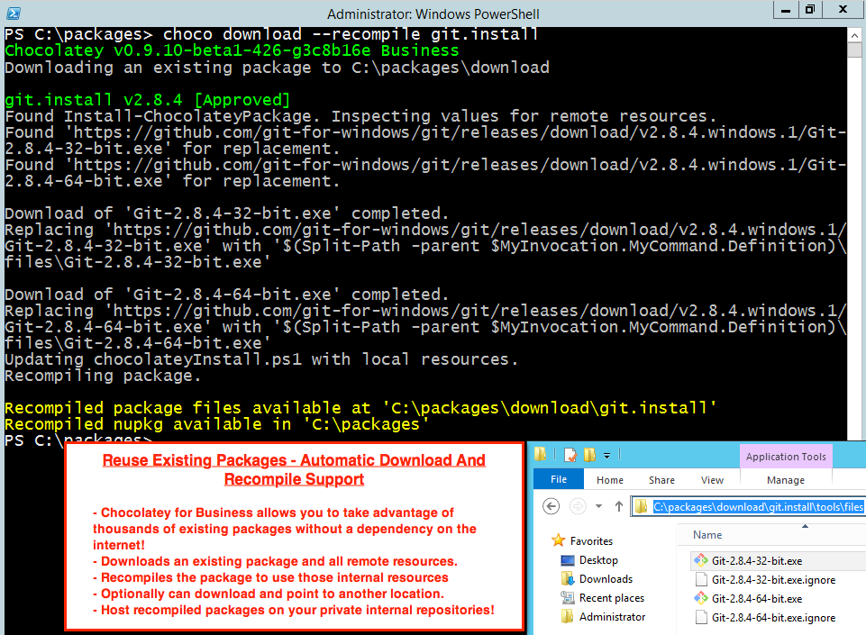

# Package Internalizer
Automatically Internalize/Recompile Existing Packages (Business Editions Only)

There are thousands of existing packages on the [community repository](https://chocolatey.org/packages) that are a tremendous resource when it comes to creating packages that have software that can sometimes be tricky! Unfortunately you may be wary of using those packages without changes because many of those packages are subject to distribution rights and thus have an internet dependency (which creates both [[trust and control issues|CommunityPackagesDisclaimer]]). There is a process for downloading and internalizing packages to use internal or embedded locations for that software that is called **recompiling**.

Chocolatey for Business is able to automatically download packages and resources, edit the scripts, and recompile packages to internalize and remove internet dependencies from those packages, saving you hours of time in [[manually recompiling packages|How-To-Recompile-Packages]]!

## Usage

Call `choco download` with options including the name of an existing package for Chocolatey for Business to download and download all existing remote resources.

<!--
Text in the image above:

Reuse Existing Packages - Automatic Download and Recompile Support

- Chocolatey for Business allows you to take advantage of thousands of existing packages without a dependency on the internet!
- Downloads an existing package and all remote resources.
- Recompiles the package to use those internal resources.
- Optionally can download and point to another location.
- Host recompiled packages on your private internal repositories!

This image shows running `choco download --recompile git.install`.

-->

## See It In Action

## Options and Switches

When running `choco download` in the Business editions, pass the following:

~~~sh

     --recompile
     Recompile - Download all external resources and recompile the package to
       use the local resources instead.

     --outputdirectory=VALUE
     OutputDirectory - Specifies the directory for the downloaded Chocolatey
       package file. If not specified, uses the current directory.
~~~

See [[download command|CommandsDownload]] for more information.

## FAQ

### How do I take advantage of this feature?
You must have a [Business edition of Chocolatey](https://chocolatey.org/compare). Business editions are great for organizations that need to manage the total software management lifecycle.

### I'm a licensed customer, now what?
You can run `choco download` and point it to an existing package name on any remote resource, typically folks point to `https://chocolatey.org/api/v2/` and let Chocolatey do all of the work of getting the package and remote resources to recompile the package.

### How does it work?
It downloads a package locally. Then it looks at the install script to determine if there are remote resources, which are downloaded to a directory in the package (or with another switch will be placed on a file share or setup for an http location). Then it edits the install script to use the local resources instead and recompiles the package. The process takes about as long as it takes to download the remote resources.

### Does it work with all types of packages?
Some packages are already internalized or don't have remote resources. In those cases it will just download the existing package and have it available for pushing to an internal repository.

### It was not able to download a resource. Why not?
This feature is in preview, but is able to download/recompile quite a few packages. There are a few that it may have issues with, especially if variables with methods are used (e.g. `$(somevar).Replace(".","")`). In those cases it attempts to warn you ahead of time that it cannot handle those yet.

### Are all packages guaranteed to be compatible?
Unfortunately not all packages on the community repository are created equal, even with the rigorous moderation process. A few packages do not use the built-in functions for acquiring files from the internet, so they don't lend well to automatic recompiling. Typically Chocolatey will let you know when this is the case and allow you to inspect the package to allow you to finish up the next steps of recompiling. As a future enhancement, it's possible this scenario would also be supported, although it is a very small subset of packages that are created in this way.
