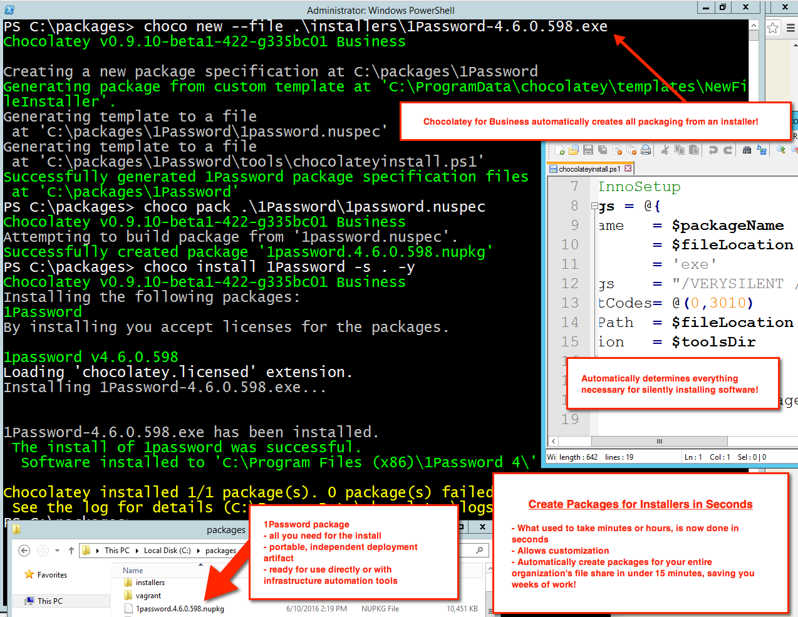

# Package Builder - Create Packages Automatically From Installers (Business Editions Only)

Creating packages is a pretty quick process as compared to manually installing software on multiple machines. There is still some time involved to create a package. Even the best packagers take between 5-10 minutes to create a package. Chocolatey can do the same in 5-10 seconds when pointed to native installers and zips! You can even point package builder to both a 32-bit and 64-bit url and seconds later you have a fully functioning package using all local/embedded resources!

Chocolatey for Business is able to inspect an installer and determine silent arguments and complete packaging components for you, saving you hours of time in packaging and maintaining software!

## Usage

When calling `choco new`, just add `--file=value` to point to a native installer and Chocolatey for Business will automatically determine the silent arguments, create the packaging and wrap that all around the installer.

<!--
Text in the image above:

Chocolatey for Business automatically creates all packaging from an installer!

Create Packages for Installers In Seconds

- What used to take minutes or hours, is now done in seconds.
- Allows customization
- Automatically create packages for your entire organization's file share in under 15 minutes, saving you weeks of work.

This image shows running `choco new --file .\installers\1Password-4.6.0.598.exe`.

-->

## See It In Action

## Options and Switches

When running `choco new` in the Business editions, pass the following:

~~~sh
     --file=VALUE
     Inspect a file (installer) to determine everything and create a package.
       Available in 0.9.10+. Business versions only.
~~~

## FAQ

### How do I take advantage of this feature?
You must have a [Business edition of Chocolatey](https://chocolatey.org/compare). Business editions are great for organizations that need to manage the total software management lifecycle.

### I'm a licensed customer, now what?
When you run `choco new`, you can add `--file` and point Chocolatey at the installer file and let Chocolatey figure out everything for creating a package and the silent arguments and wrap that around the installer.

### How does it work?
It inspects the installer file using a series of rules that helps determine the installer type. From there it builds a package with the information it is able to extract from the installer.

### Will it catch all types of installers?
It is able to detect 12 types of installers currently.

### Does it always find the silent uninstall arguments?
In over 90% of the cases it will, but not always. Even with this in mind, it still removes 90% of the packaging work. See the next question on how to handle cases where it can not.

### This was unable to detect custom installer arguments.
Unfortunately, some installers out there are just a pain to work with. In the case of custom installers, you may be able to find the silent arguments for install and uninstall by searching online. If you can not find anything, consider unpacking the installer and putting the software binaries directly in the package.

### Does it create auto unattend files?
Unfortunately, it is not able to do this. See the [[automatic internalize and recompile packages feature|FeaturesAutomaticallyRecompilePackages]] to take advantage of thousands of existing packages without a need for internet access.

### Does it work with zip archive?
Not currently, but archives are on the future enhancements list.

### Does this work with keeping the installer on a UNC share or elsewhere yet?
Not yet, but it's easy to edit the package once it has done all of the hard work for you.
