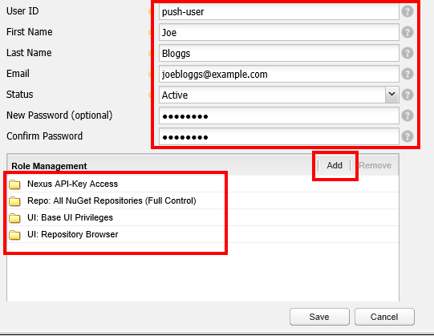
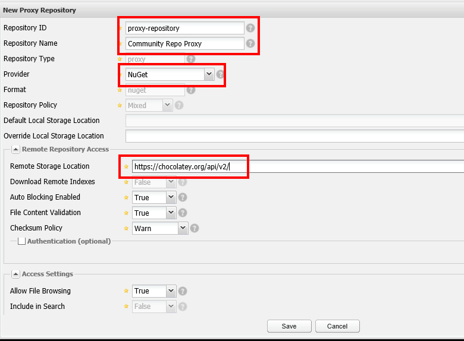

# How To Setup An Internal Package Repository With Sonatype Nexus

<!-- TOC -->

- [Summary](#summary)
- [Pre-Requisites](#pre-requisites)
- [Install Sonatype Nexus](#install-sonatype-nexus)
- [Create A Hosted Repository For Chocolatey Packages](#create-a-hosted-repository-for-chocolatey-packages)
  - [Create User To Push Packages To The Repository](#create-user-to-push-packages-to-the-repository)
  - [Obtain Repository API Key](#obtain-repository-api-key)
  - [Push A Test Package](#push-a-test-package)
  - [Install A Package](#install-a-package)
- [Create a Proxy Repository For Chocolatey Community Repository](#create-a-proxy-repository-for-chocolatey-community-repository)
  - [Install A Package](#install-a-package-1)
  - [What Packages Is Your Proxy Repository Storing](#what-packages-is-your-proxy-repository-storing)
- [Saving Your Repository Source In Chocolatey](#saving-your-repository-source-in-chocolatey)

<!-- /TOC -->

## Summary

While the Chocolatey Community Repository is a great resource for packages, it is [not recommended for direct use by organizations](how-to-setup-internal-package-repository#organizational-requirements). But that doesn't mean you have to miss out on using the tens of thousands of packages that it contains. The solution is to setup an internal repository to host your own packages and we are going to discuss the use of [Sonatype Nexus](https://sonatype.com) for this task.

There are two types of repositories you can setup:

* Hosted Repository - this is where only the packages that have been pushed directly to the repository are available for use;
* Proxy Repository - this is where you can use Nexus as a go-between for another repository, in this case the Chocolatey Community Repository. When you install or upgrade a package it is downloaded from that other repository and then stored (or cached) locally by Nexus. On each subsequent install / upgrade the Nexus package will be used. So you're only ever downloading from the other repository once.

## Pre-Requisites

Sonatype Nexus needs to be installed on a machine, whether that be a physical machine or a virtual machine. Follow these steps before doing so:

1. Create a server with [Windows Server 2016](https://www.microsoft.com/en-us/evalcenter/evaluate-system-center) - this can be a virtual or physical server. Details on how to create a server are beyond the scope of this guide;
1. [Install Chocolatey](https://chocolatey.org/install#installing-chocolatey);
1. From the Chocolatey Community Repository [download](https://chocolatey.org/api/v2/package/putty/0.70) the [putty.install version 0.70](https://chocolatey.org/packages/putty.install/0.70) package - this will be used later during our tests;

We have provided a [Vagrant build](https://github.com/chocolatey/chocolatey-environments) to install Nexus on a Windows Server 2016 virtual machine. All you need to do is download the `putty.install` package once complete.

## Install Sonatype Nexus

If you are using the [Vagrant build](https://github.com/chocolatey/chocolatey-environments) you can skip this section. If you want to install Nexus yourself, then:

1. [Create a server and ensure you have the pre-requisites](#server-pre-requisites) before continuing.
1. Install the Nexus software using Chocolatey by running `choco install nexus-oss -y`;
1. Open a browser and navigate to `https://localhost:8081/nexus` and you will see the default Nexus page.
1. Click the **Log In** button in the top right hand corner;
1. If you have not changed the defaults then see [**Step 1: Change the Administrative Password and Email Address**](https://help.sonatype.com/repomanager3/installation/post-install-checklist) for the defaults. **If the repository will be used in production we strongly recommend you change your username and / or password.**;
1. Expand **Administration** on the left hand side and click **Server**;
1. Scroll down to, and expand, **Security Settings**:
  
  * In **Available Realms** click **NuGet API-Key Realm** and then click the arrow pointing to **Select Realms** (looks like a backwards play button). **Selected Realms** should now contain **NuGet API-Key Realm**. Adding this option allows you to authenticate against NuGet repositories using an API Key;
  * Click **Save**;

## Create A Hosted Repository For Chocolatey Packages

We can create a repository using PowerShell or the browser. If you want to use the browser, follow the steps below:

1. Click the **Log In** button in the top right hand corner;
1. If you have not changed the defaults then see [**Step 1: Change the Administrative Password and Email Address**](https://help.sonatype.com/repomanager3/installation/post-install-checklist) for the defaults. **If the repository will be used in production we strongly recommend you change your username and / or password.**;
1. Go to **Views/Repositories**;
1. Click **Repositories**, click **Add** -> **Hosted Repository** and complete the details (note if you hover over the `?` at the end of each field it will provide you with help):
  
  * **Repository ID** - this will form part of the URL so **no spaces**;
  * **Repository Name** - a name for you to identify the repository by;
  * **Provider** - choose `NuGet`;
  * Click **Save**;
5. Click the **NuGet** tab on the repository you have just created and note the `Package Source` URL - this will be the URL you need to use as your `--source` parameter and we will call it `<HOSTED REPOSITORY PACKAGE SOURCE URL>` going forward;
  

If you want to create the repository using the Nexus REST API and PowerShell, follow the steps below:

```powershell
$json = @{
    data = @{
      id           = "test-repo"
      name         = "Test Repository"
      provider     = "nuget-proxy"
      providerRole = "org.sonatype.nexus.proxy.repository.Repository"
      repoType     = "hosted"
      repoPolicy   = "MIXED"
    }
}

# this is the default username and password for Nexus. Amend if you have changed that.
# See https://help.sonatype.com/repomanager3/installation/post-install-checklist
$username = 'admin'
$password = 'admin123'
$auth = [Convert]::ToBase64String([Text.Encoding]::ASCII.GetBytes(("{0}:{1}" -f $username, $password)))

$params = @{
    Method      = 'Post'
    Uri         = 'http://localhost:8081/nexus/service/local/repositories'
    ContentType = 'application/json'
    Headers     = @{ Authorization = "Basic $auth" }
    Body        = ($json | ConvertTo-Json)
}

# invoke the Nexus API
$result = Invoke-RestMethod @params

# View the result after invoking the Nexus API
$result.data

# This will be the URL you need to use as your `--source` parameter and we
# will call it `<HOSTED REPOSITORY PACKAGE SOURCE URL>` going forward
$result.data.ContentResourceURI
```

At this stage we have created the repository. Now let's just check we can use it. Run `choco list --source <HOSTED REPOSITORY PACKAGE SOURCE URL>`.

```powershell
> choco list --source "http://localhost:8081/nexus/service/local/nuget/test-repo/"

Chocolatey v0.10.13

0 packages found.
```

There are no packages yet in the repository so we are expecting `0 packages found` so this is a successful test.

### Create User To Push Packages To The Repository

By default anybody will be able to install / upgrade packages from the repository. However only authenticated users will be able to push packages to the repository. The authentication used is an **API Key**. Let's go ahead and create a user with permission to push packages to the repository.

When creating a user to push packages we can again create it through the browser or using PowerShell. If you want to follow the steps and create it through the browser, follow these steps:

1. **Log In** as the `admin` user (or another user you have created with Administrator privileges);
1. If you have not changed the defaults then see [**Step 1: Change the Administrative Password and Email Address**](https://help.sonatype.com/repomanager3/installation/post-install-checklist) for the defaults. **If the repository will be used in production we strongly recommend you change your username and / or password.**;
1. Go to **Security** -> **Users** and then click the **Add** button and then **Nexus User** (note if you hover over the `?` at the end of each field it will provide you with help):
  
  * Enter **User ID**, **First Name**, **Last Name** and **Email**;
  * Set **Status** to `Active`
  * When you get to the **Role Management** field, click the **Add** button and add the following roles:
    * `Nexus Api-Key Access` - this allows the user to authenticate using the NuGet API Key (unless you have setup an alternative method of authentication you will want to use this);
    * `UI: Base UI Privileges` and `UI: Repository Browser` - this will allow the user to log into the Nexus Dashboard and retrieve their API Key. Once this is done you can remove these roles if you do not want the user to be able to log in;
    * `Repo: All NuGet Repositories (Full Control)` - this access allows the user to push packages to the repository;
  * Click **Save**;

To use PowerShell we will again use the Nexus REST API:

```powershell
$json = @{
    data = @{
      userId       = "push-user"
      firstName    = "Joe"
      lastName     = "Bloggs"
      email        = "joebloggs@example.com"
      status       = "active"
      password     = "password"
      roles        = @{
        '0' = 'nx-apikey-access'
        '1' = 'nuget-all-full'
        '2' = 'ui-basic'
        '3' = 'ui-repo-browser'
      }
    }
}

# this is the default username and password for Nexus. Amend if you have changed that.
# See https://help.sonatype.com/repomanager3/installation/post-install-checklist
$username = 'admin'
$password = 'admin123'
$auth = [Convert]::ToBase64String([Text.Encoding]::ASCII.GetBytes(("{0}:{1}" -f $username, $password)))

$params = @{
    Method      = 'Post'
    Uri         = 'http://localhost:8081/nexus/service/local/users'
    ContentType = 'application/json'
    Headers     = @{ Authorization = "Basic $auth" }
    Body        = ($json | ConvertTo-Json)
}

# invoke the Nexus API
$result = Invoke-RestMethod @params

# View the result after invoking the Nexus API
$result.data
```

### Obtain Repository API Key

As we mentioned earlier, a user must authenticate to the repository in order to be able to push packages to it. To do that they need to retrieve their API Key from the repository. We can do that from the browser or by using PowerShell.

Follow these steps if you wish to use the browser:

1. **Log In** as the user who will be pushing packages (created [above](#create-user-to-push-packages-to-the-repository));
1. Click **Repositories** in the left hand column and then click the repository that the user user will push packages to;
1. Click the **NuGet** tab and:
  
   * Note the URL in `Package Source`. We will need this later to push packages to;
   * Click the **View API Key** button and then note the key show in the `Personal API Key` field and will be called `<API KEY>` going forward;

We can also obtain the API Key using PowerShell. Note that each time you run this code (particularly the `Invoke-RestMethod @params` line, a new API key will be generated and old one will be invalid.

```powershell
# this is the username and password we set for the user we created above.
# Amend if you have changed that.
# See https://help.sonatype.com/repomanager3/installation/post-install-checklist
$username = 'push-user'
$password = 'password'
$auth = [Convert]::ToBase64String([Text.Encoding]::ASCII.GetBytes(("{0}:{1}" -f $username, $password)))

$params = @{
    Method      = 'Post'
    Uri         = 'http://localhost:8081/nexus/service/apikeys/nuget'
    ContentType = 'application/json'
    Headers     = @{ Authorization = "Basic $auth" }
}

# invoke the Nexus API
# NOTE: Each time you run this it will generate a new API Key so
# the old one will be invalid.
$result = Invoke-RestMethod @params

# View the result after invoking the Nexus API.
# The result here is the API Key and will be called `<API KEY>` going forward;
$result
```

Now we have created a repository, and a user with permissions to push packages to it, let's push a package!

### Push A Test Package

You could of course use any packages, including your own but we are going to use the `putty.install` package that was downloaded [earlier](#pre-requisites).

Before we start to push packages let's just remind ourselves that the repository is empty. Run `choco list --source <HOSTED REPOSITORY PACKAGE SOURCE URL>`:

```powershell
> choco list --source "http://localhost:8081/nexus/service/local/nuget/test-repo/"

Chocolatey v0.10.13

0 packages found.
```

Now let's push the first package to our repository. From the directory you saved the `putty.install` package to, run `choco push putty.install.0.70.nupkg --source <HOSTED REPOSITORY PACKAGE SOURCE URL> --apikey <API KEY>`:

```powershell
> choco push putty.install.0.70.nupkg --source "http://localhost:8081/nexus/service/local/nuget/test-repo/" --apikey "e01d1a43-abd5-3b94-838b-2d33528891fa"

Chocolatey v0.10.13

Attempting to push putty.install.0.70.nupkg to http://localhost:8081/nexus/service/local/nuget/test-repo/
putty.install 0.70 was pushed successfully to http://localhost:8081/nexus/service/local/nuget/test-repo/
```

Let's check the package is now appearing in the list. Run `choco list --source <HOSTED REPOSITORY PACKAGE SOURCE URL>`:

```powershell
> choco list --source "http://localhost:8081/nexus/service/local/nuget/test-repo/"

Chocolatey v0.10.13

putty.install 0.70
1 packages found.
```

### Install A Package

The first package we pushed was successful. Let's install that package now by running `choco install putty.install --source <HOSTED REPOSITORY PACKAGE SOURCE URL>`:

```powershell
> choco install putty.install --source "http://localhost:8081/nexus/service/local/nuget/test-repo/"

Chocolatey v0.10.13

Installing the following packages:
putty.install
By installing you accept licenses for the packages.
Progress: Downloading putty.install 0.70... 100%

putty.install v0.70
putty.install package files install completed. Performing other installation steps.
Installing 64-bit putty.install...
putty.install has been installed.
  putty.install may be able to be automatically uninstalled.
Environment Vars (like PATH) have changed. Close/reopen your shell to
 see the changes (or in powershell/cmd.exe just type `refreshenv`).
 The install of putty.install was successful.
  Software installed as 'msi', install location is likely default.

Chocolatey installed 1/1 packages.
 See the log for details (C:\ProgramData\chocolatey\logs\chocolatey.log).
```

Note that we didn't use an API key here as we were _installing_ from the repository and not _pushing_ packages to it. For our examples you _only_ need to use an API key if you are pushing packages to the repository.

## Create a Proxy Repository For Chocolatey Community Repository

Here we are going to setup a Proxy Repository to allow us to proxy package requests to the Chocolatey Community Repository.

A proxy repository will allow us to indirectly use the Chocolatey Community Repository as a feed for packages. As the connection goes through the proxy repository URL, Nexus will check whether the package requested is already stored locally. If it is, it will return that package to us directly with no connection being made to the Chocolatey Community Repository. If it doesn't have it, it will download the package from the Chocolatey Community Repository and then store it locally. The next time that package is installed or upgraded it will not have to go back to the Chocolatey Community Repository to retrieve it.

To setup a Proxy Repository we can use the browser or use PowerShell and the Nexus REST API. Follow these steps if you wish to use the browser:

1. Click the **Log In** button in the top right hand corner;
1. If you have not changed the defaults then see [**Step 1: Change the Administrative Password and Email Address**](https://help.sonatype.com/repomanager3/installation/post-install-checklist) for the defaults. **If the repository will be used in production we strongly recommend you change your username and / or password.**;
1. Go to **Views/Repositories**;
1. Click **Repositories**, click **Add** -> **Proxy Repository** and complete the details (note if you hover over the `?` at the end of each field it will provide you with help):
  
  * **Repository ID** - this will form part of the URL so **no spaces**;
  * **Repository Name** - a name for you to identify the repository by;
  * **Provider** - choose `NuGet`;
  * **Remote Repository Access** -> **Remote Storage Location** - this should be `https://chocolatey.org/api/v2/`;
  * Click **Save**;

5. Click the **NuGet** tab on the repository you have just created and note the `Package Source` URL - this will be the URL you need to use as your `--source` parameter and will be called `<PROXY REPOSITORY PACKAGE SOURCE URL>` going forward;

    

To use PowerShell and the Nexus REST API, run this code:

```powershell
$json = @{
    data = @{
      id           = "proxy-repo"
      name         = "Proxy Repository"
      provider     = "nuget-proxy"
      providerRole = "org.sonatype.nexus.proxy.repository.Repository"
      repoType     = "proxy"
      repoPolicy   = "MIXED"
    }
}

# this is the default username and password for Nexus. Amend if you have changed that.
# See https://help.sonatype.com/repomanager3/installation/post-install-checklist
$username = 'admin'
$password = 'admin123'
$auth = [Convert]::ToBase64String([Text.Encoding]::ASCII.GetBytes(("{0}:{1}" -f $username, $password)))

$params = @{
    Method      = 'Post'
    Uri         = 'http://localhost:8081/nexus/service/local/repositories'
    ContentType = 'application/json'
    Headers     = @{ Authorization = "Basic $auth" }
    Body        = ($json | ConvertTo-Json)
}

# invoke the Nexus API
$result = Invoke-RestMethod @params

# View the result after invoking the Nexus API
$result.data

# This will be the URL you need to use as your `--source` parameter and we
# will call it `<PROXY REPOSITORY PACKAGE SOURCE URL>` going forward
$result.data.ContentResourceURI
```

Note that you can't push packages to a Proxy Repository as it doesn't support this.

### Install A Package

Let's install a package. As we have no packages in the repository as yet, any packages we do install will come from the URL we added as the **Remote Storage Location** [earlier](#create-a-proxy-repository-for-chocolatey-community-repository). Run `choco install winscp.portable --source <PROXY REPOSITORY PACKAGE SOURCE URL>`:

```powershell
> choco install winscp.portable --source "http://localhost:8081/nexus/service/local/nuget/proxy-repo/"

Chocolatey v0.10.13

winscp.portable v5.15.1
winscp.portable package files install completed. Performing other installation steps.
 ShimGen has successfully created a shim for WinSCP.exe
 The install of winscp.portable was successful.
  Software install location not explicitly set, could be in package or
  default install location if installer.

Chocolatey installed 1/1 packages.
 See the log for details (C:\ProgramData\chocolatey\logs\chocolatey.log).
```

### What Packages Is Your Proxy Repository Storing

So we installed the WinSCP package through the Proxy Repository so lets see the packages stored in the repository:

1. Click the **Log In** button in the top right hand corner;
1. If you have not changed the defaults then see [**Step 1: Change the Administrative Password and Email Address**](https://help.sonatype.com/repomanager3/installation/post-install-checklist) for the defaults. **If the repository will be used in product we strongly recommend you change your username and / or password.**;
1. Go to **Views/Repositories**;
1. Click **Repositories** then click the **Proxy Repository** you created  [earlier](create-a-proxy-repository-for-chocolatey-community-repository);
1. Under the **Browse Storage** tab you will see the `winscp.portable` package listed (note if you do not see the package click the **Refresh** button);
  * Click the **+** button underneath to see the versions we have stored.

  

Any installation of the WinSCP package version we have stored, using the Proxy Repository as a source, will come directly from that repository and not from the Chocolatey Community Repository.

## Saving Your Repository Source In Chocolatey

In here we have explicitly passed the `--source` parameter to the Chocolatey commands. Remember you can instead [add the repository as a package source](https://chocolatey.org/docs/commands-sources) to avoid having to do that. Note however that you must still use the source explicitly when pushing a package.